**OBJECTIVE**:

To study the mechanical properties of Mild Steel specimen under tension load.

**STEPS**:

1. Click on the Tensile Test on Mild Steel file, a window will open as shown  
   [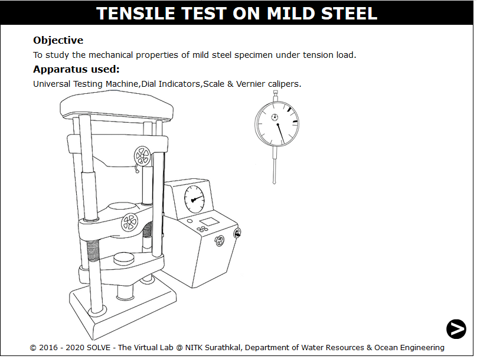](./images/proc1.png)

2. Click on the NEXT button to move to the next step.  
   [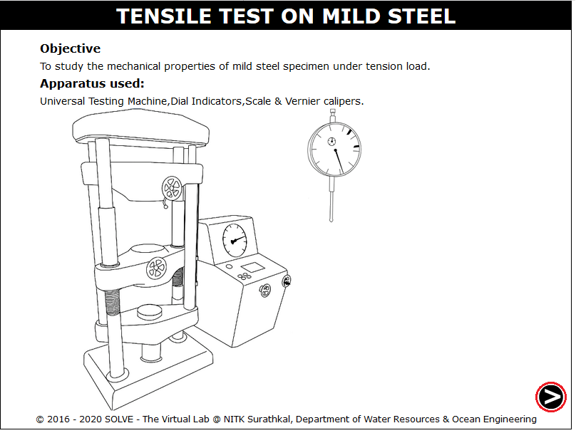](./images/proc2.png)

3. To measure the diameter of the specimen using Vernier Caliper, click on the calliper knob to adjust to the diameter.  
   [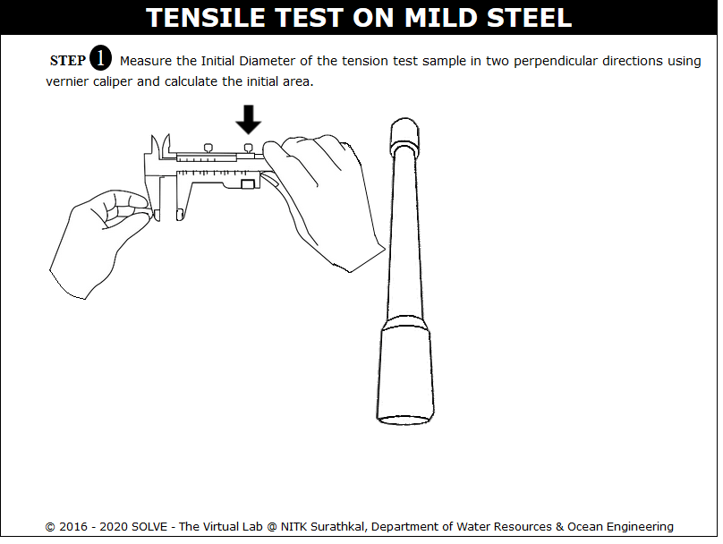](./images/proc3.png)

4. Click on the measuring scale to measure the length of the specimen between the grips  
   [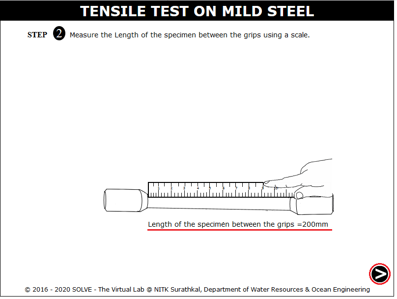](./images/proc4.png)

5. Click on hammer to make a punch mark at a distance of 2.5d, then click NEXT button.  
   [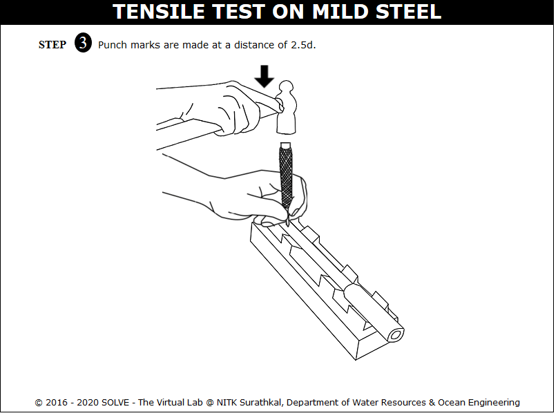](./images/proc5.png)

6. Click on the roatating lever to lower the machine bottom part, drag the specimen and place it on the position where the arrow is pointing ,then again click on rotating lever to adjust the height and then the dial gauge is mounted.  
   [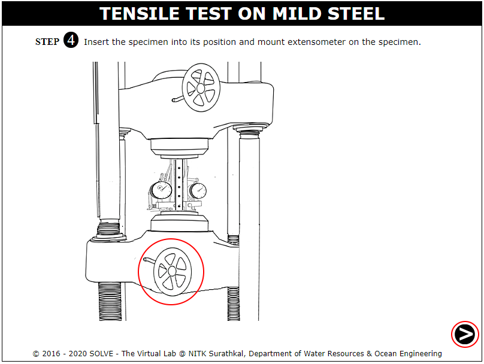](./images/proc6.png)

7. Readings on the dials of extensometer are adjusted to zero by clicking on adjusting knob of extensometer.  
   [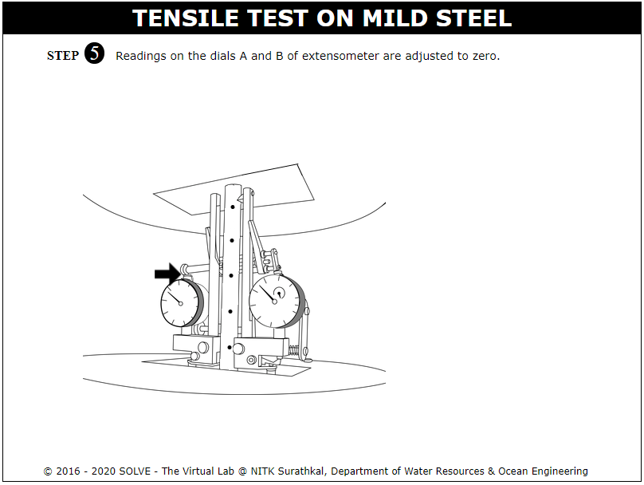](./images/proc7.png)

8. Click on GREEN button to switch on the machine, the extensometer reading variation with load is observed and can be downloaded via Download Data  
   [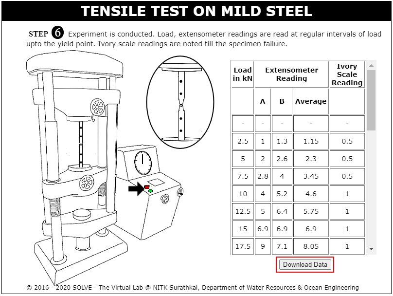](./images/proc8.png)

9. Here the stress strain graph of test is shown, click on View Data to view the data.  
   [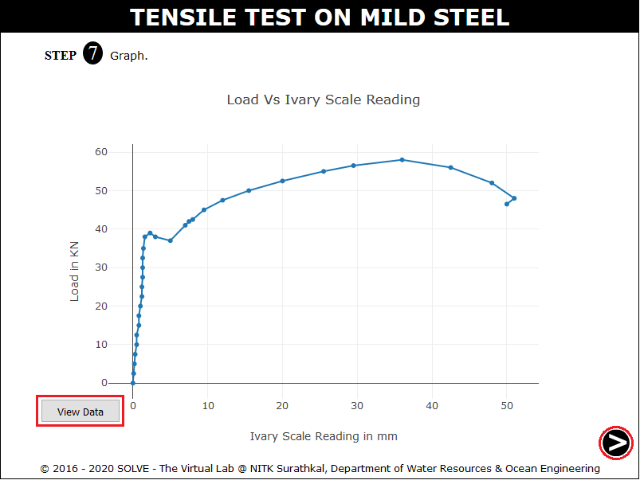](./images/proc9.png)

10. Click on View Data or View Slope to view test data or the slope drawn to the plot.  
    [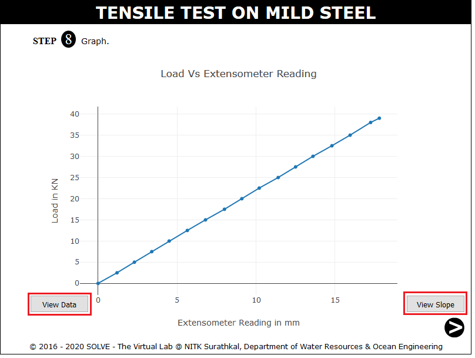](./images/proc10.png)

11. Click on Join the pieces of the specimen to join it to measure the change in diameter.  
    [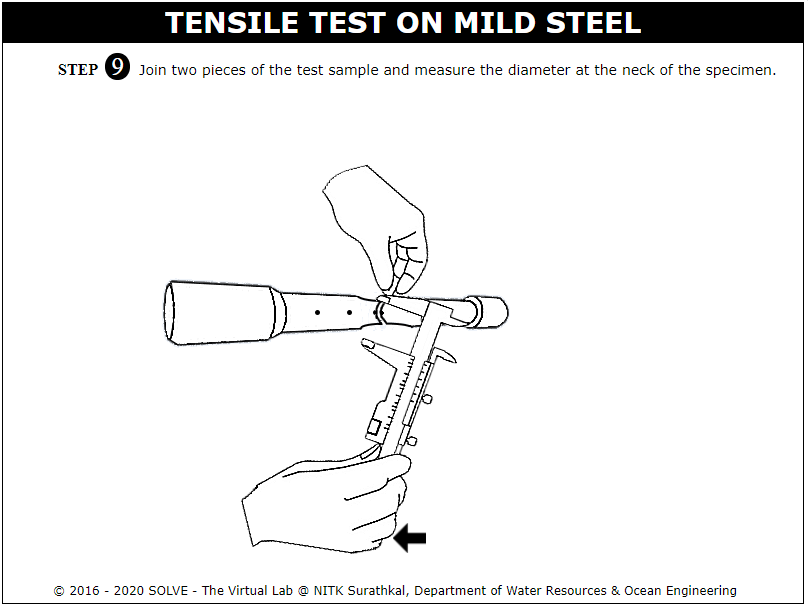](./images/proc11.png)

12. Join the two specimen to measure the change in specimen length.  
    [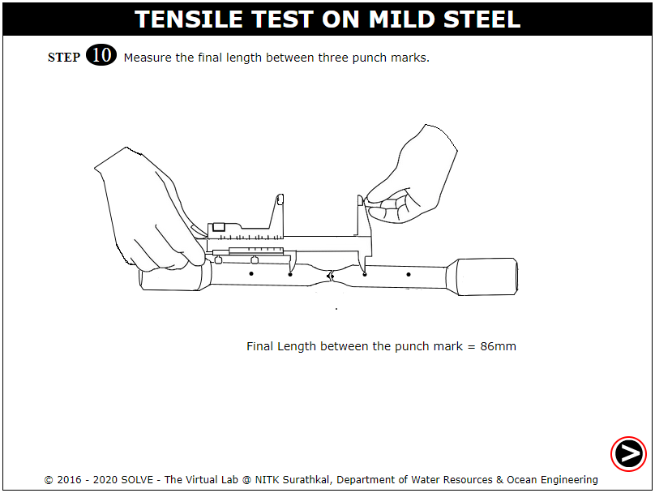](./images/proc12.png)

13. Input the calulated result and then click on Check to view the actual result.  
    [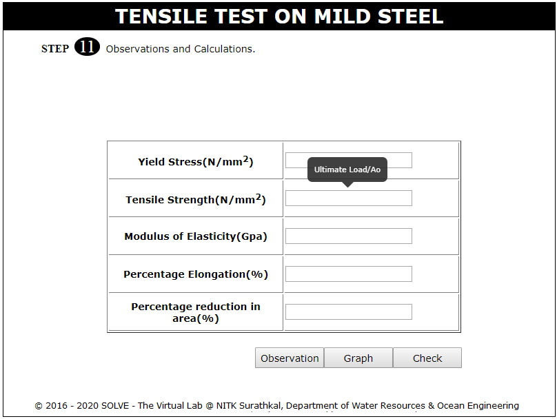](./images/proc13.png)
