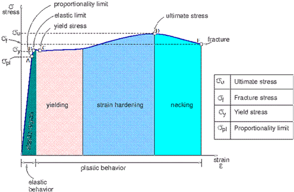
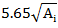
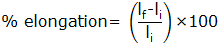
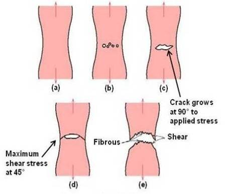
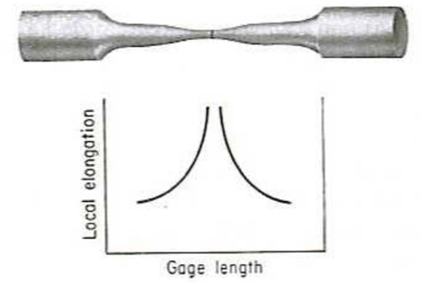

In tension test ends of a test piece are fixed into grips connected to a straining device and to a load measuring device. The test involves straining a test piece by tensile force generally to fracture for the purpose of determining one or more of the mechanical properties.

The straining unit of universal testing machine consists of main hydraulic cylinder with robust base inside and piston which moves up and down. The lower table connected to main piston through a ball & the ball seat is joined to ensure axial loading. There is a connection between lower table and upper head assembly that moves up and down with main piston. The control panel consists of a power pack complete with drive motor and an oil tank, control valves and an autographic recorder. Load Indicator system consists of a large dial and a pointer. A dummy pointer is provided to record the maximum load reached during the test.

Load is applied by a hydrostatically lubricated ram. Main cylinder pressure is transmitted to the cylinder of the pendulum dynamometer system housed in the control panel.The cylinder of the dynamometer is also of self-lubricating design. The load transmitted to the cylinder of the dynamometer is transferred through a lever system to a pendulum.Displacement of the pendulum actuates the rack and pinion mechanism which operates the load indicator pointer and the autographic recorder. The deflection of the pendulum represents the absolute load applied on the test specimen. Return movement of the pendulum is effectively damped to absorb energy in the event of sudden breakage of a specimen.

**STRESS STRAIN GRAPH OF MILD STEEL**:

The stress strain graph of mild steel is divided into four areas in which the first section represents elastic deformation and in remaining areas only plastic deformation will takes place. However, the material behaves differently in each individual phase of plastic deformation. Area B defines the flow region here the material is stressed beyond its elastic loadability and within the flow region the stress changes very irregularly with increasing strain so that a wavy line results in the graph. In section C the stress increase sharply and the plastic deformation also increases. At the maximum loadability the material's cross-section begins to reduce in size and ultimately failure occurs.increase sharply and the plastic deformation also increases. At the maximum loadability the material's cross-section begins to reduce in size and ultimately failure occurs.

**Elastic deformation (A)**

The first phase of the stress-strain damage is elastic deformation. When the stress acting on the material is removed the material regains its original length. This is called complete recovery or resilience. Again the area of elastic deformation is divided into two phases. In the first phase the material stretches proportionally to the stress acting on it. This extension is also called linear-elastic or proportional deformation.The point at which the linear-elastic elongation is maximum is called the proportional limit. Beyond this limit elastic deformation still takes place, however greater elongation occurs in this section under increasing applied force. Therefore the elongation or strain is greater than the increasing stress.

**The flow region (B)**

Further small increase in stress can be enough to cause the proportional limit to be exceeded. The highest flow point is the point accompanied by an initial sudden loss of quality. As a result, the stress required to continue to elongate the material reduces immediately and reaches the lowest flow point.

After these points are exceeded even if the forces are removed immediately the material does not regain its original properties. When the stress is increased again the dislocations start to wander and increases, which leads to further quality losses at the first flow point, stress and strain behave irregularly in relation to each other.

**Material hardening (C)**

If the stress is increased further an increasing number of upright dislocations form in the crystal lattice prevents the movement of the previous still sliding dislocations. At the same time the stress in the crystal lattice continues to increase which causes hardening of the material. Here the metal becomes stronger as the strain increases. Hence, it is called as "Strain Hardening". However, this process cannot be continued infinitely. Each material has its specific maximum force.

**Necking (D)**

If the maximum force is exceeded the material begins to neck.In the crystal lattice of the metal bar so many dislocations have occurred that they can no longer lead to hardening but instead contribute to the formation of voids or cavities. Apart from necking, the voids also cause the material cross-section to reduce. The stress now acts on an increasingly smaller cross-section which enhances this process still further. As the tensile test continues the necking increases until the tapered cross-section can no longer withstand the stress. This is when the metal bar tears at the weakest point. Finally the specimen will have increase in length and reduction in cross sectional area.

Percentage elongation: Increase in the gauge length of the test piece at maximum force, expressed as a percentage of the original gauge length (li).The value of percentage elongation depends on the gauge length chosen according to the B.I.S specifications a gauge length of  (5d rods) is to be used.

Where, Li= initial length

Lf= final length

Percentage reduction in area: Maximum change in cross-sectional area that has occurred at the neck during the test expressed as a percentage of the original cross-sectional area.

Where, Ai= initial length

Af= final length

**Tensile strength**: Stress corresponding to the maximum force.

**Yield strength**: When the metallic material exhibits a yield phenomenon, a point is reached during the test at which plastic deformation occurs without any increase in the force.

**Modulus of elasticity**: It is the slope of initial linear portion of stress strain curve.

**Stages in ductile fracture**:

The failure of ductile material under tensile loading can be attributed to cup and cone fracture. This form of ductile fracture occurs in stages that initiates after necking. First small micro-voids form in the interior of the material. Next deformation continues and the micro-voids enlarge to form cracks. The crack continues to grow and it spreads laterally towards the edges of the specimen. Finally the crack propagation is rapid along a surface that makes about 45 degree angle with the tensile stress axis. The new fracture surface has an irregular appearance. The final shearing of the specimen produces a cup type shape on one fracture surface, and cone type shape on adjacent fracture surface. In this central interior region has an irregular and fibrous appearance, which signifies plastic deformation in material.

Detailed and important information on the mechanism of fracture can be obtained from microscopic examination of fracture surfaces. This study is known as fractography.

**Variation of local elongation with position along gauge length of tensile specimen**:

The measured elongation from a tension specimen depends on the gauge length of the specimen or dimension of its cross section. This is because the total extension consists of two components, the uniform extension up to necking and the localised extension once necking begins.

The extent of uniform extension depends on the metallurgical condition of the material and the effect of specimen size and shapes on the development of neck. The shorter the gauge length,greater is the percentage elongation.

**RELEVANT INDIAN STANDARD FOR TENSION TEST**:

1. IS 1608(2005): Metallic Materials - Tensile Testing At Ambient Temperature
